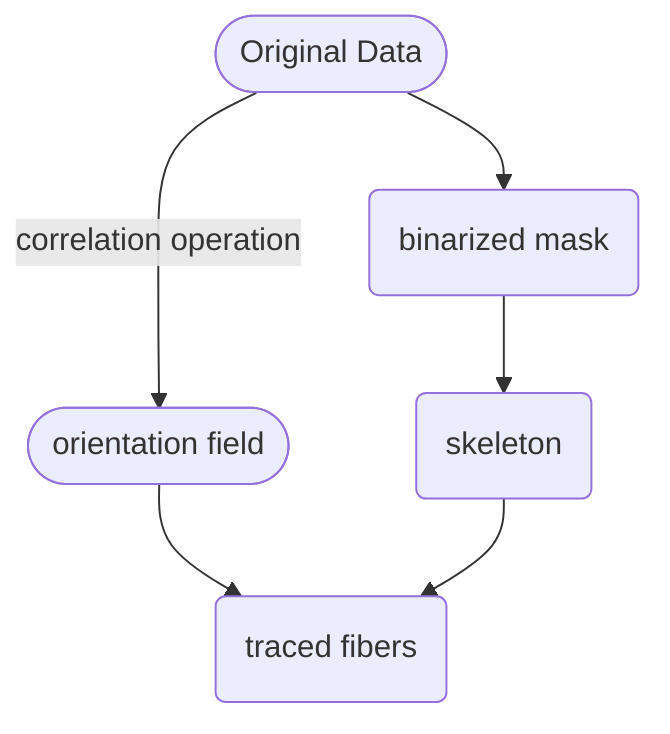
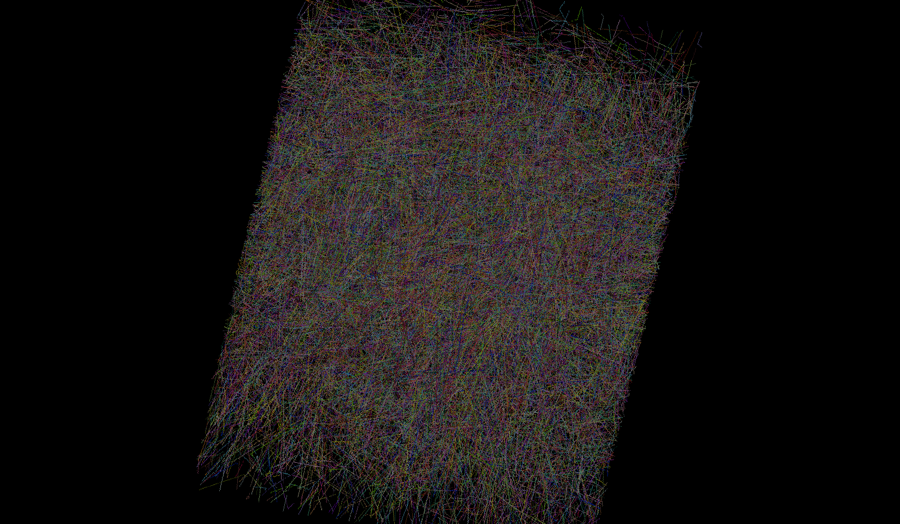

# Tracing Fibers in 3D CT Volume
Trace the 3D short fibes which were filled in the polymer matrix

Author: Dr. Benke Li (李本科)

Author's ORCID: https://orcid.org/0000-0002-8830-0563

Author's ResearchGate: https://www.researchgate.net/profile/Benke-Li

## Work flow:

## Background:
Tracing high-concentrated fibers in the 3D CT images is not an easy task; this repository provides an efficient way to trace fibers based on the orientation fields obtained by convolve operations.
<!-- toc -->

Due to the high concentration (see [original data](#origin-data)) of the filled fibers, the fibers tend to interact with each other, and they seemed to be "connected" in the 3D CT images (see [local view](#local-view)). So, the fibers should be traced so that to seperate them from each other during image segmentation operations, so as to obtain correct orientation tensors of the fibers. We utilized the orientation field of the 3D CT data (see file `step1-cal_orientation_field.ipynb` for algorithm details) to trace the fibers successfully (see file `step2-individual_fiber_segmentation.ipynb` for tracing details). And the tracing results is shown in [traced fibers](#traced-fibers).

## Dependencies: 
numpy, scipy, scikit-image, pandas, matplotlib, napari, imageio

## Usage: 
1. Make sure `python3` and dependencies were installed. The denpendencies could be install by the command:
   ```
   python3 -m pip3 install numpy scipy scikit-image pandas matplotlib napari imageio
   ```
2. Download this package, or by command:
   ```
   git clone https://github.com/libenke/CT_FiberSegmentation
   ```
3. The 3D CT data should be stored as ".tiff" files for each slices in one folder, each folder for each volume data.
4. Fill the data folder path in the assignment statement `data_dirs = ["demo_data",]` both in the files `step1-cal_orientation_field.py` and `step2-individual_fiber_segmentation.py`.
5. Run in the terminal:
   ```
   python -m step1-cal_orientation_field.py
   python -m step2-individual_fiber_segmentation.py
   ```   
6. The results were stored as numpy files `.npy` and HDF5 files `.h5` in the data folders.
<!-- tocstop -->
### original data

### local view

### traced fibers

