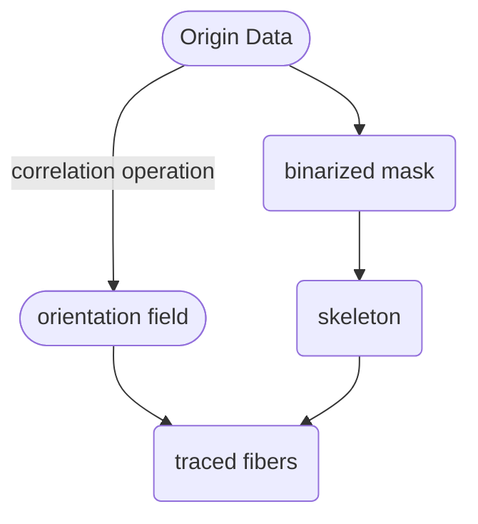
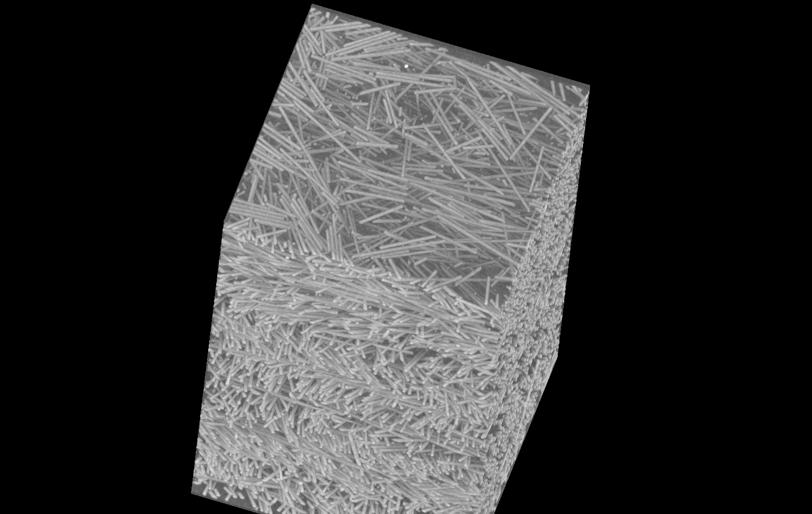
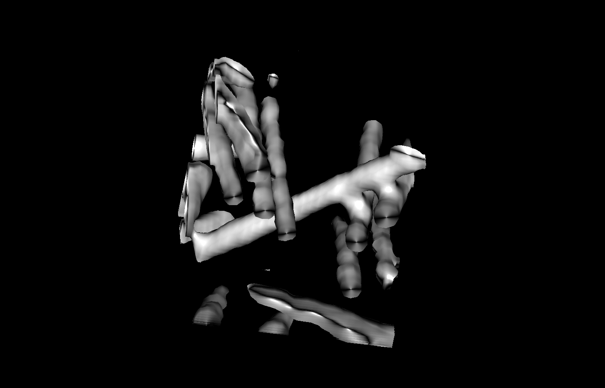

# CT_FiberSegentation
segment the short fibes filled in the polymer matrix from the CT 3D volume data
# The processing work flow is as below: 

# why
<!-- toc -->

- [CT\_FiberSegentation](#ct_fibersegentation)
- [The processing work flow is as below:](#the-processing-work-flow-is-as-below)
- [why](#why)
    - [origin data](#origin-data)
    - [local view](#local-view)
    - [final lines](#final-lines)
  
<!-- tocstop -->
### origin data

### local view

### final lines
